<div align="center">

# 🌍 Tourist Places App

### Discover & Manage Tourist Destinations — Built with Flutter & Firebase

*A modern, highly responsive Flutter application that helps users discover beautiful tourist places, view detailed destination information, and allows administrators to manage places seamlessly.*

<br/>


</div>

---

## 📖 Overview

**Tourist Places** is a comprehensive travel companion app that helps users explore top-rated tourist destinations across various cities. It features an intuitive user interface to view place details, check customized visiting orders, and manage personal profiles. Powered by **Firebase**, it also offers a robust **Admin Dashboard** with role-based access, enabling administrators to efficiently update and manage the database of locations in real time.

---

## 🌟 Key Features

- **🔐 Authentication & Roles** — Secure login and registration flow with built-in role-based access (Admin & Regular User) via Firebase Authentication.
- **🌍 Explore Places** — Discover a wide range of tourist destinations, explore places city-wise, and read detailed descriptions for each location.
- **🗺️ Visiting Order** — Get optimized visiting sequences to plan your travel routes efficiently.
- **🛠️ Admin Dashboard** — A dedicated administrative panel for adding, updating, and managing tourist spots and destinations seamlessly.
- **🌓 Dynamic Theming** — Built-in Light and Dark mode support (`ThemeProvider`) for an enhanced and comfortable viewing experience.
- **☁️ Cloud Sync** — Integrated with Firebase Firestore for real-time data updates, ensuring your app stays synced across devices.
- **👤 Profile Management** — Dedicated profile screens allowing users to manage and edit their personal information.

---

## 🛠️ Tech Stack

| Layer                         | Technology                                             |
|--------------------------------|---------------------------------------------------------|
| Framework                     | Flutter & Dart                                         |
| State Management              | **Provider** (Theme & App State)                       |
| API Integration & Networking  | `http` package for REST API calls                      |
| Backend as a Service (BaaS)   | Firebase (Firestore for Database, Authentication)      |
| Local Storage                 | `shared_preferences`                                   |
| UI / Styling                  | `google_fonts`, `cupertino_icons`                      |

---

## 📂 Project Structure

```
lib/
│
├── theme/                        # Dynamic theme settings (Dark/Light mode)
│   ├── app_theme.dart
│   └── theme_provider.dart
│
├── admin_screen.dart             # Admin dashboard for managing places
├── user_home_screen.dart         # Main hub for users to discover places
├── city_places_screen.dart       # Filter and view places by specific cities
├── place_details_screen.dart     # Detailed information view of a tourist place
├── visiting_order_screen.dart    # Optimized travel itineraries
│
├── login_screen.dart             # User login & authentication
├── register_screen.dart          # User registration & onboarding
├── splash_screen.dart            # Initial app launch screen
├── edit_profile_screen.dart      # User profile management
│
├── api_service.dart              # Networking and backend services
├── main.dart                     # App entry point & Auth Wrapper
└── pad_icon.dart                 # Custom icon/widget components
```

---

## 🖼️ App Screenshots

### Authentication & Home

<table>
  <tr>
    <td align="center"><b>App Splash</b></td>
    <td align="center"><b>Login Screen</b></td>
    <td align="center"><b>Registration</b></td>
  </tr>
  <tr>
    <td>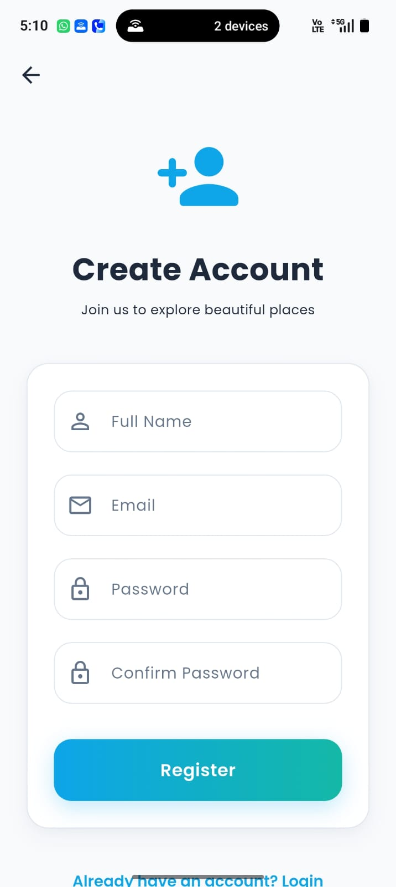</td>
    <td>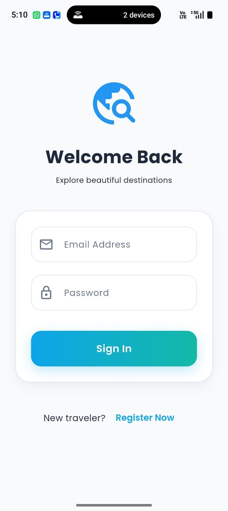</td>
    <td>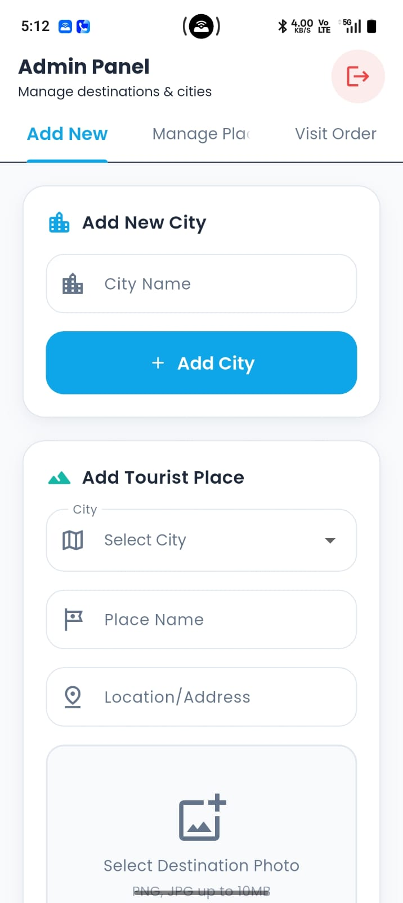</td>
  </tr>
  <tr>
    <td align="center"><b>Home / Dashboard</b></td>
    <td align="center"><b>City Places</b></td>
    <td align="center"><b>Place Details</b></td>
  </tr>
  <tr>
    <td>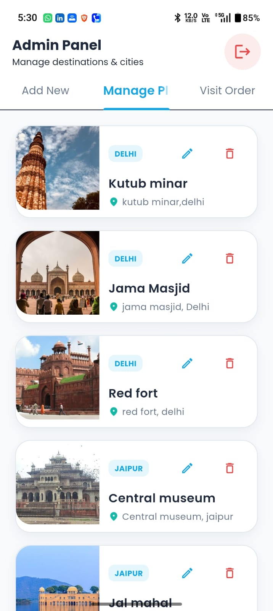</td>
    <td>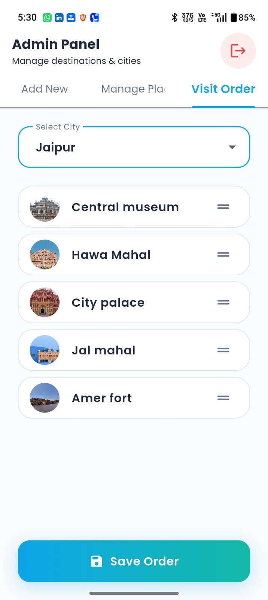</td>
    <td>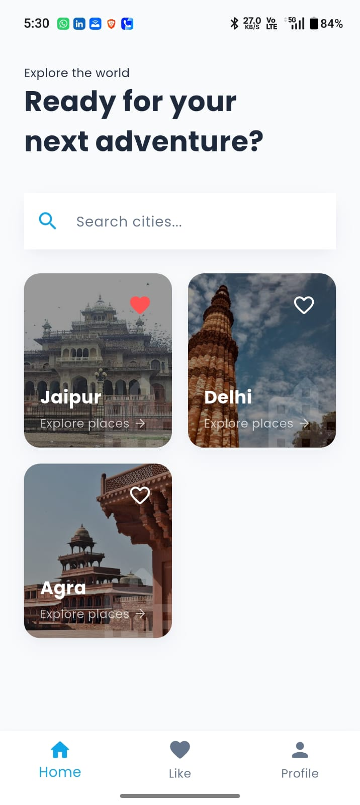</td>
  </tr>
</table>

### Features & Admin

<table>
  <tr>
    <td align="center"><b>Visiting Order</b></td>
    <td align="center"><b>User Profile</b></td>
    <td align="center"><b>Edit Profile</b></td>
  </tr>
  <tr>
    <td>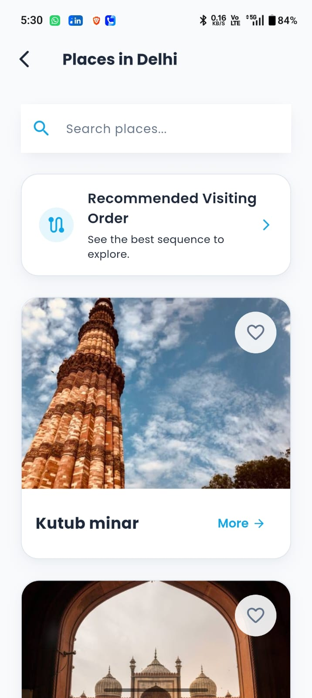</td>
    <td>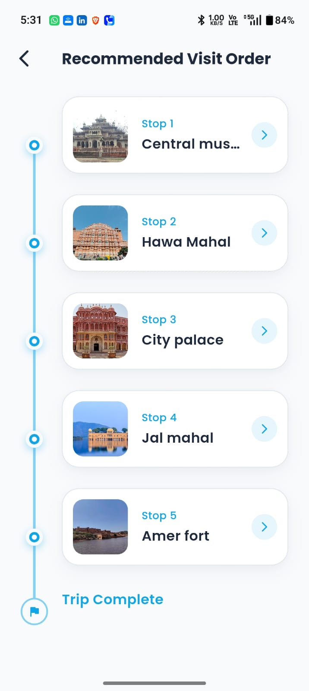</td>
    <td>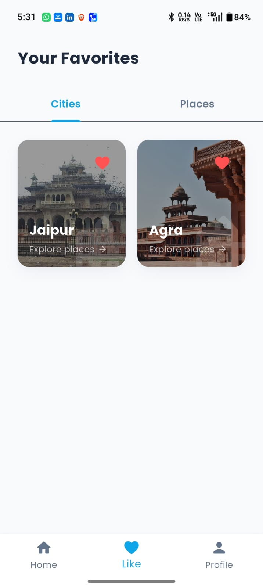</td>
  </tr>
  <tr>
    <td align="center"><b>Admin Dashboard</b></td>
    <td align="center"><b>Settings / Theme</b></td>
    <td></td>
  </tr>
  <tr>
    <td>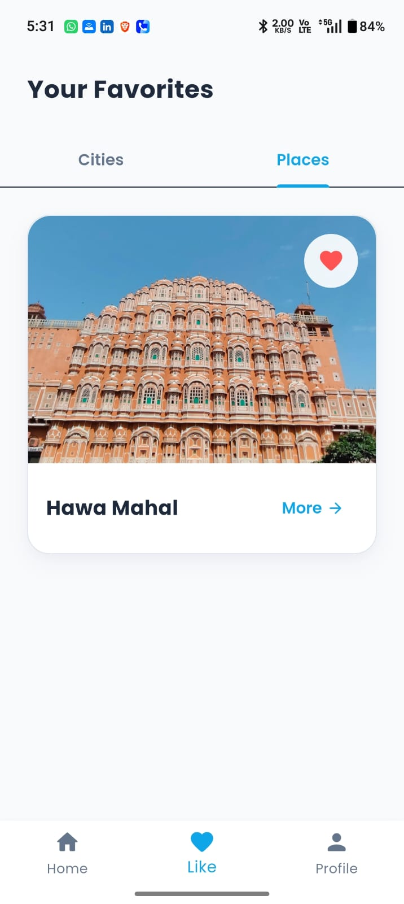</td>
    <td>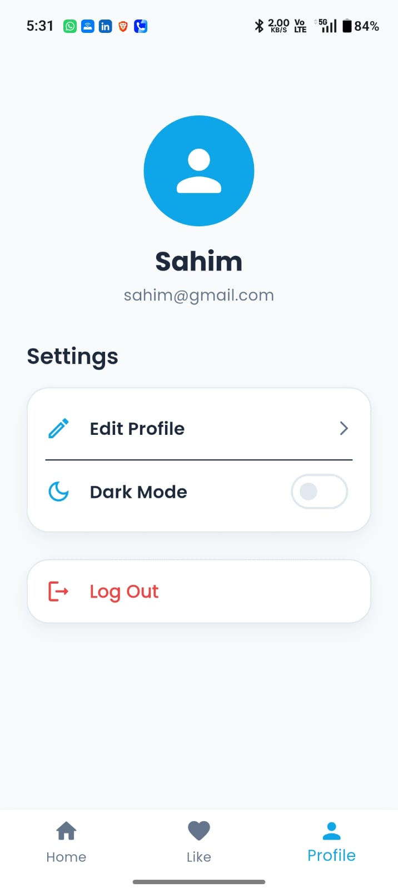</td>
    <td></td>
  </tr>
</table>

> 💡 **Note:** Screenshots are loaded from the `assets/screenshots/` folder in this repository. Ensure the folder is committed for images to render correctly on GitHub.

---

## 🚀 Installation & Setup

1. **Clone the repository**
   ```bash
   git clone <your-repository-url>
   cd touristplace
   ```

2. **Install dependencies**
   ```bash
   flutter pub get
   ```

3. **Firebase Setup**
   - Connect the app to your Firebase project.
   - Add your `google-services.json` (for Android) and `GoogleService-Info.plist` (for iOS).

4. **Run the app**
   ```bash
   flutter run
   ```

---

## 🗺️ Roadmap

- [ ] Add offline support for viewing previously loaded places.
- [ ] Implement integrated map views for navigation (Google Maps API).
- [ ] Add user reviews and ratings for tourist spots.
- [ ] Introduce a travel planner and customizable itineraries.
- [ ] Multi-language support for international tourists.

---

<div align="center">

### 🌍 Explore the World with Tourist Places App

**Tourist Places** — *Your ultimate digital travel guide.*

</div>
